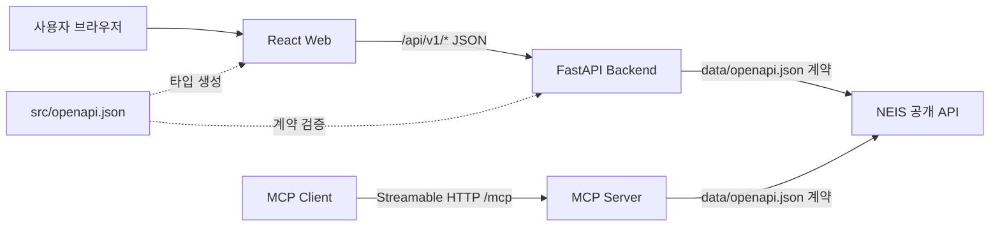

# TRD - 급식 배틀: 학교 급식 조회 앱

| 항목 | 내용 |
| --- | --- |
| 문서 상태 | 승인 (Approved) |
| 버전 | 1.3 |
| 제품명 | 급식 배틀 - 학교 급식 조회 앱 |
| 기준 PRD | [`PRD.md` v1.2](./PRD.md) |
| 작성자 | 프로젝트 팀 |
| 작성일 | 2026-08-17 |
| 최종 수정일 | 2026-08-17 |
| 대상 릴리스 | MVP |
| 관련 이슈 | [GitHub Issue #4](https://github.com/justinyoo/bsl-pyconkr/issues/4), [GitHub Issue #5](https://github.com/justinyoo/bsl-pyconkr/issues/5), [GitHub Issue #8](https://github.com/justinyoo/bsl-pyconkr/issues/8) |
| 외부 API 명세 | [`data/openapi.json`](./data/openapi.json) |
| 내부 API 명세 | [`src/openapi.json`](./src/openapi.json) |

### 변경 이력

| 버전 | 날짜 | 변경 내용 | 작성자 |
| --- | --- | --- | --- |
| 0.1 | 2026-08-17 | 최초 기술 설계, 내부 API 계약 및 테스트 전략 작성 | 프로젝트 팀 |
| 1.0 | 2026-08-17 | 기술 설계 검토 완료 및 승인 | 프로젝트 팀 |
| 1.1 | 2026-08-17 | Python 패키지 관리와 애플리케이션 실행 도구를 `uv`로 명시 | 프로젝트 팀 |
| 1.2 | 2026-08-17 | 구현 결과에 맞춰 단일 URL 상태, 저장소 구조, 실행 스크립트, 로깅 및 테스트 현황 반영 | 프로젝트 팀 |
| 1.3 | 2026-08-17 | 공식 MCP SDK 1.x 기반 Streamable HTTP 서버, 도구, 오류 처리 및 Compose 통합 추가 | 프로젝트 팀 |

## 1. 문서 목적

이 문서는 승인된 `PRD.md`를 구현하기 위한 기술 구조와 책임을 정의한다.
애플리케이션은 React 기반 프론트엔드, Python 기반 백엔드와 독립 Python MCP
서버로 구성한다. 로컬 개발에서는 통합 스크립트가 세 개발 서버를 직접 실행하고,
컨테이너 통합 검증과 배포 형태의 실행에는 Docker Compose를 사용한다.

외부 NEIS 계약과 내부 애플리케이션 계약은 다음과 같이 분리한다.

- `data/openapi.json`: 백엔드가 호출하는 NEIS 공개 API의 원본 계약
- `src/openapi.json`: 프론트엔드와 백엔드가 공유하는 내부 HTTP API 계약

`src/openapi.json`은 프론트엔드 클라이언트 타입과 백엔드 계약 검증의 단일
원본으로 사용한다. 외부 NEIS 응답 구조를 프론트엔드에 그대로 노출하지 않는다.

## 2. 기술 목표와 제약

### 2.1 목표

- 학교 검색, 날짜 범위 선택, 중식 조회의 세 단계를 명확히 분리한다.
- 외부 NEIS 응답을 안정적인 내부 데이터 모델로 변환한다.
- 프론트엔드는 내부 OpenAPI 계약만 알고 NEIS API를 직접 호출하지 않는다.
- NEIS API 키와 외부 서비스 오류를 백엔드 경계에서 안전하게 처리한다.
- 각 계층을 독립적으로 테스트하고 전체 사용자 흐름을 E2E로 검증한다.

### 2.2 제약

- 프론트엔드는 React 기반으로 구현한다.
- 백엔드는 Python 기반으로 구현한다.
- 식사 종류는 NEIS `MMEAL_SC_CODE=2`인 중식으로 고정한다.
- 조회 가능한 날짜는 직전 달 1일부터 오늘까지로 제한한다.
- 사용자 인증과 데이터베이스는 MVP 범위에 포함하지 않는다.
- 프론트엔드에서 NEIS 호스트 또는 API 키로 직접 요청해서는 안 된다.

## 3. 기술 스택

| 영역 | 선택 | 선정 이유 |
| --- | --- | --- |
| 프론트엔드 | React, TypeScript, Vite | 빠른 개발 환경, 엄격한 타입, 기존 CI의 TypeScript 구성과 일치 |
| 화면 상태 | 단일 `/` URL과 React 컴포넌트 상태 | 검색 조건을 주소에 노출하지 않고 세 단계 흐름 관리 |
| 서버 상태 | TanStack Query | 검색 debounce 이후 요청, 캐시, 로딩·오류·재시도 상태 관리 |
| Date Picker | React DayPicker 기반 범위 선택 컴포넌트 | 접근 가능한 키보드 탐색과 날짜 범위 선택 지원 |
| 스타일 | CSS Modules 또는 전역 디자인 토큰 | Bento Grid와 네오 브루탈리즘을 불필요한 UI 프레임워크 종속 없이 구현 |
| 백엔드 | FastAPI, Pydantic | OpenAPI 친화적이며 입력 검증과 비동기 HTTP API 구현에 적합 |
| MCP 서버 | 공식 MCP Python SDK `>=1.29,<2`, FastMCP | MCP 1.x 호환, 구조화된 도구 출력과 Streamable HTTP 지원 |
| 외부 HTTP | HTTPX | 비동기 요청, 타임아웃, 테스트 대체가 용이 |
| Python 실행 | Python 3.12, `uv run` | 가상 환경을 직접 활성화하지 않고 잠긴 환경에서 명령 실행 |
| 패키지 관리 | npm, Python `uv` + `pyproject.toml` + `uv.lock` | 재현 가능한 의존성 해석과 로컬·CI·컨테이너 환경의 일관성 보장 |
| 오케스트레이션 | Bash/PowerShell 통합 스크립트, Docker Compose | 로컬 직접 실행과 컨테이너 통합 검증을 각각 재현 가능하게 제공 |

React DayPicker는 화면에 직접 노출되는 제품 컴포넌트가 아니라 Date Picker를
구성하는 기반 라이브러리로 사용한다. 앱 전용 래퍼에서 한국어 레이블, 유효 범위,
선택 요약과 오류 표시를 통제한다.

## 4. 시스템 아키텍처



### 4.1 데이터 흐름

1. 사용자가 프론트엔드에 학교명 일부를 입력한다.
2. 프론트엔드는 `GET /api/v1/schools`를 호출한다.
3. 백엔드는 NEIS `GET /hub/schoolInfo`를 호출하고 필요한 필드만 정규화한다.
4. 사용자가 학교와 날짜 범위를 선택한다.
5. 프론트엔드는 `GET /api/v1/schools/{schoolCode}/meals`를 호출한다.
6. 백엔드는 NEIS `GET /hub/mealServiceDietInfo`를 중식 조건으로 호출한다.
7. 백엔드는 `<br/>` 기반 문자열과 숫자 필드를 내부 모델로 정규화해 반환한다.
8. 프론트엔드는 누락된 날짜를 계산하여 "급식 정보 없음" 카드를 표시한다.

MCP 클라이언트 흐름은 다음과 같다.

1. MCP 클라이언트가 Streamable HTTP `/mcp`에 연결하고 도구 목록을 조회한다.
2. `search_schools`가 NEIS 학교 기본 정보 API를 호출해 후보를 정규화한다.
3. 클라이언트가 선택한 교육청 코드와 학교 코드를 날짜 범위와 함께
   `get_school_lunches`에 전달한다.
4. MCP 서버가 중식 조건으로 NEIS 급식 API를 호출하고 구조화된 결과 또는
   `isError=true` 도구 오류를 반환한다.

### 4.2 신뢰 경계

- 브라우저 입력과 NEIS 응답은 모두 신뢰하지 않고 검증한다.
- `NEIS_API_KEY`는 백엔드와 MCP 서버 환경 변수로만 주입하고 브라우저나 MCP
  도구 결과에 노출하지 않는다.
- 프론트엔드 번들, URL, 로그 또는 API 응답에 비밀 값을 포함하지 않는다.
- 백엔드는 외부 오류를 내부 표준 오류 형식으로 변환하고 원시 응답 전체를
  사용자에게 노출하지 않는다.

## 5. 구성 요소별 책임

### 5.1 프론트엔드

- 학교 검색 입력, 결과 목록과 단일 선택 상태 관리
- 300ms debounce 후 공백 제거 기준 2자 이상일 때 검색 요청
- Date Picker의 기본 범위를 오늘의 7일 전부터 오늘까지로 설정
- 직전 달 1일보다 이전이거나 오늘보다 이후인 날짜 및 역순 범위 차단
- 선택 범위 요약·초기화와 결과 화면의 학교·날짜 재선택 제공
- 내부 OpenAPI 명세에서 생성한 타입 안전 클라이언트로만 백엔드 호출
- 로딩, 빈 결과, 유효성 오류, 네트워크 오류와 명시적인 재시도 동작 표시
- 백엔드가 반환하지 않은 날짜를 선택 범위 내에서 계산해 빈 카드 표시
- 제공된 원산지, 영양 정보, 칼로리와 급식 인원을 날짜별 카드에 표시
- Bento Grid + 네오 브루탈리즘 스타일과 반응형·접근성 요구사항 구현

### 5.2 백엔드 API

- 내부 OpenAPI 계약에 따른 요청 검증과 응답 직렬화
- `data/openapi.json`에 정의된 NEIS 학교·급식 API 호출
- NEIS 인증키, 타임아웃 및 외부 오류 관리
- NEIS 응답의 `head`와 `row` 구조 파싱
- 외부 필드명을 내부 camelCase 모델로 변환
- 중식 조건 강제와 조회 기간 검증
- 요리명, 원산지와 영양 정보의 `<br/>` 계열 구분자를 배열로 변환
- 날짜 오름차순 정렬 및 표준 오류 응답 생성

### 5.3 NEIS 클라이언트

백엔드 내부의 NEIS 클라이언트는 라우터와 분리한다.

- `search_schools(name)`: `/hub/schoolInfo` 호출
- `get_lunches(office_code, school_code, from_date, to_date)`:
  `/hub/mealServiceDietInfo` 호출
- 모든 요청에 `Type=json`, 페이지 번호, 페이지 크기와 서버 보관 API 키 주입
- 연결 및 전체 응답 타임아웃 적용
- `INFO-200`은 정상적인 빈 결과로 변환
- 인증, 요청 제한, 서비스 장애 등은 구체적인 외부 서비스 예외로 전달

### 5.4 MCP 서버

- 백엔드와 별도인 `src/mcp` Python 패키지 및 프로세스로 실행
- 공식 `mcp` SDK 1.x의 `FastMCP`와 Streamable HTTP `/mcp` 전송 사용
- `search_schools`: 학교명 일부로 학교·교육청·지역·식별 코드 반환
- `get_school_lunches`: 교육청 코드, 학교 코드와 기간으로 중식 정보 반환
- Pydantic 모델 기반 구조화된 출력과 자동 생성 input/output schema 제공
- 입력 오류, 빈 결과와 NEIS 인증·제한·응답·가용성 오류를 `ToolError`로 변환
- 도구 오류에는 원본 응답, API 키, query string 및 내부 예외를 포함하지 않음

## 6. 저장소 구조

애플리케이션 코드와 테스트 코드는 모두 `src/` 아래에 둔다. 저장소 루트에는
문서, 외부 원본 데이터, Compose 설정과 공통 프로젝트 파일만 유지한다.

```text
.
├── src/
│   ├── web/                 # React 프론트엔드 앱
│   │   ├── src/
│   │   │   ├── api-client/  # OpenAPI 생성 타입과 API 어댑터
│   │   │   ├── components/  # Search, DatePicker, MealCard
│   │   │   ├── hooks/       # TanStack Query와 UI 훅
│   │   │   ├── lib/         # 날짜 정책과 누락 날짜 계산
│   │   │   ├── pages/       # 학교 검색, 날짜 선택, 결과
│   │   │   ├── test/        # 테스트 설정과 MSW 핸들러
│   │   │   ├── App.tsx      # 단일 URL 단계와 선택 상태
│   │   │   └── index.css    # 디자인 토큰과 공통 스타일
│   │   ├── Dockerfile
│   │   └── package.json
│   ├── api/                 # FastAPI 백엔드 앱
│   │   ├── src/bsl_api/
│   │   │   ├── api/         # FastAPI 라우터
│   │   │   ├── clients/     # NEIS 클라이언트
│   │   │   ├── models/      # 내부 요청·응답 모델
│   │   │   ├── services/    # 조회와 변환 로직
│   │   │   ├── middleware.py # 요청 ID와 요청 완료 로그
│   │   │   └── settings.py
│   │   ├── tests/
│   │   │   ├── unit/
│   │   │   └── integration/
│   │   ├── Dockerfile
│   │   ├── pyproject.toml
│   │   └── uv.lock
│   ├── mcp/                 # 독립 Streamable HTTP MCP 서버
│   │   ├── src/bsl_mcp/     # 도구, 서비스, 모델, NEIS 클라이언트
│   │   ├── tests/           # 단위 및 MCP 프로토콜 통합 테스트
│   │   ├── Dockerfile
│   │   ├── pyproject.toml
│   │   └── uv.lock
│   ├── e2e/                 # Playwright E2E 프로젝트
│   └── openapi.json         # 프론트엔드-백엔드 내부 계약
├── scripts/                 # Bash/PowerShell 실행·전체 테스트 스크립트
├── data/
│   └── openapi.json         # NEIS 외부 계약
└── compose.yml
```

## 7. 내부 OpenAPI 계약

### 7.1 공통 규칙

- OpenAPI 버전: `3.0.4`
- 기본 경로: `/api/v1`
- 데이터 형식: `application/json`
- 오류 형식: `application/problem+json`
- JSON 속성명: `camelCase`
- 날짜: ISO 8601 `YYYY-MM-DD`
- 모든 문자열 입력은 앞뒤 공백을 제거한 후 검증
- 성공 응답에 NEIS의 원본 대문자 필드명을 노출하지 않음

### 7.2 엔드포인트 요약

| Method | Endpoint | 목적 | 성공 응답 |
| --- | --- | --- | --- |
| `GET` | `/api/v1/health` | 백엔드 생존 확인 | `HealthResponse` |
| `GET` | `/api/v1/schools?name={name}` | 부분 학교명 검색 | `SchoolSearchResponse` |
| `GET` | `/api/v1/schools/{schoolCode}/meals?officeCode={code}&from={date}&to={date}` | 날짜 범위의 중식 조회 | `MealRangeResponse` |

### 7.3 `GET /api/v1/health`

요청 Payload는 없다.

**200 응답**

```json
{
  "status": "ok"
}
```

### 7.4 `GET /api/v1/schools`

#### 요청

| 위치 | 이름 | 타입 | 필수 | 제약 |
| --- | --- | --- | --- | --- |
| Query | `name` | string | 예 | 공백 제거 후 2~100자 |

```http
GET /api/v1/schools?name=서울고
Accept: application/json
```

#### 200 응답 Payload

```json
{
  "items": [
    {
      "schoolCode": "7010113",
      "educationOfficeCode": "B10",
      "schoolName": "서울고등학교",
      "educationOfficeName": "서울특별시교육청",
      "locationName": "서울특별시",
      "schoolType": "고등학교"
    }
  ],
  "total": 1
}
```

| 필드 | 타입 | 필수 | 설명 |
| --- | --- | --- | --- |
| `items` | `SchoolSummary[]` | 예 | 일치 학교 목록 |
| `total` | integer | 예 | 응답에 포함된 학교 수 |
| `schoolCode` | string | 예 | NEIS 행정표준코드 |
| `educationOfficeCode` | string | 예 | 시도교육청 코드 |
| `schoolName` | string | 예 | 학교명 |
| `educationOfficeName` | string | 예 | 시도교육청명 |
| `locationName` | string 또는 null | 예 | 시도명 |
| `schoolType` | string 또는 null | 예 | 학교 종류 |

검색 결과가 없으면 `200`과 `{"items": [], "total": 0}`을 반환한다.

### 7.5 `GET /api/v1/schools/{schoolCode}/meals`

#### 요청

| 위치 | 이름 | 타입 | 필수 | 제약 |
| --- | --- | --- | --- | --- |
| Path | `schoolCode` | string | 예 | 1~20자 |
| Query | `officeCode` | string | 예 | 1~20자 |
| Query | `from` | date | 예 | ISO `YYYY-MM-DD` |
| Query | `to` | date | 예 | ISO `YYYY-MM-DD`, `from` 이상 |

`from`과 `to`는 서버의 한국 표준시 기준 직전 달 1일부터 오늘까지의 범위에
있어야 한다. 백엔드는 NEIS 호출 시 이를 `MLSV_FROM_YMD`,
`MLSV_TO_YMD` 형식인 `YYYYMMDD`로 변환하고 `MMEAL_SC_CODE=2`를 강제한다.

```http
GET /api/v1/schools/7010113/meals?officeCode=B10&from=2026-08-10&to=2026-08-17
Accept: application/json
```

#### 200 응답 Payload

```json
{
  "school": {
    "schoolCode": "7010113",
    "educationOfficeCode": "B10",
    "schoolName": "서울고등학교",
    "educationOfficeName": "서울특별시교육청"
  },
  "from": "2026-08-10",
  "to": "2026-08-17",
  "meals": [
    {
      "date": "2026-08-17",
      "mealType": "lunch",
      "dishes": [
        "현미밥",
        "미역국",
        "닭갈비"
      ],
      "origins": [
        "쌀: 국내산",
        "닭고기: 국내산"
      ],
      "nutrition": [
        "탄수화물(g): 92.1",
        "단백질(g): 31.4"
      ],
      "calories": "742.3 Kcal",
      "servingCount": 530
    }
  ]
}
```

| 필드 | 타입 | 필수 | 설명 |
| --- | --- | --- | --- |
| `school` | `SelectedSchool` | 예 | 조회한 학교 식별 정보 |
| `from` | date | 예 | 요청한 시작일 |
| `to` | date | 예 | 요청한 종료일 |
| `meals` | `Meal[]` | 예 | 급식이 존재하는 날짜의 중식, 날짜 오름차순 |
| `date` | date | 예 | 급식일 |
| `mealType` | `"lunch"` | 예 | MVP에서 중식으로 고정 |
| `dishes` | string[] | 예 | 요리명 목록, 최소 1개 |
| `origins` | string[] | 예 | 원산지 목록, 미제공 시 빈 배열 |
| `nutrition` | string[] | 예 | 영양 정보 목록, 미제공 시 빈 배열 |
| `calories` | string 또는 null | 예 | 단위가 포함된 NEIS 칼로리 정보 |
| `servingCount` | integer 또는 null | 예 | 파싱 가능한 경우의 급식 인원 |

급식이 없는 날짜는 `meals`에 포함하지 않는다. 프론트엔드는 `from`부터 `to`까지
달력 날짜를 생성하고 응답과 결합하여 빈 날짜 카드를 렌더링한다. 전체 기간에
급식이 없으면 `200`과 빈 `meals` 배열을 반환한다.

### 7.6 오류 Payload

모든 4xx/5xx 응답은 다음 `ProblemDetail`을 사용한다.

```json
{
  "type": "https://example.invalid/problems/invalid-date-range",
  "title": "Invalid date range",
  "status": 400,
  "detail": "The date range must be between the first day of the previous month and today.",
  "instance": "/api/v1/schools/7010113/meals",
  "code": "INVALID_DATE_RANGE",
  "errors": {
    "to": [
      "Select a date no later than today."
    ]
  }
}
```

| Status | 코드 | 조건 |
| --- | --- | --- |
| `400` | `INVALID_REQUEST` | 검색어 누락, 잘못된 날짜 형식 등 |
| `400` | `INVALID_DATE_RANGE` | 역순이거나 직전 달 1일~오늘 범위를 벗어남 |
| `404` | `SCHOOL_NOT_FOUND` | 조회 대상 학교를 확인할 수 없음 |
| `429` | `RATE_LIMITED` | 애플리케이션 또는 NEIS 요청 제한 |
| `502` | `UPSTREAM_ERROR` | NEIS가 처리 불가능한 오류를 반환 |
| `503` | `UPSTREAM_UNAVAILABLE` | NEIS 연결 실패 또는 타임아웃 |
| `500` | `INTERNAL_ERROR` | 예상하지 못한 서버 오류 |

오류 메시지는 사용자가 조치할 수 있는 내용만 제공한다. API 키, 내부 예외
스택과 원시 NEIS 응답은 포함하지 않는다.

### 7.7 내부 OpenAPI 핵심 구조

현재 `src/openapi.json`은 다음 경로와 Payload 구조를 포함한다.

```yaml
openapi: 3.0.4
info:
  title: Battle School Lunch API
  version: 1.0.0
paths:
  /health:
    get:
      operationId: getHealth
      responses:
        "200":
          content:
            application/json:
              schema:
                $ref: "#/components/schemas/HealthResponse"
  /schools:
    get:
      operationId: searchSchools
      parameters:
        - name: name
          in: query
          required: true
          schema:
            type: string
            minLength: 2
            maxLength: 100
      responses:
        "200":
          content:
            application/json:
              schema:
                $ref: "#/components/schemas/SchoolSearchResponse"
  /schools/{schoolCode}/meals:
    get:
      operationId: getSchoolMeals
      parameters:
        - name: schoolCode
          in: path
          required: true
          schema:
            type: string
        - name: officeCode
          in: query
          required: true
          schema:
            type: string
        - name: from
          in: query
          required: true
          description: 한국 표준시 기준 직전 달 1일 이상, 오늘 이하
          schema:
            type: string
            format: date
        - name: to
          in: query
          required: true
          description: from 이상이며 한국 표준시 기준 오늘 이하
          schema:
            type: string
            format: date
      responses:
        "200":
          content:
            application/json:
              schema:
                $ref: "#/components/schemas/MealRangeResponse"
        "400":
          content:
            application/problem+json:
              schema:
                $ref: "#/components/schemas/ProblemDetail"
components:
  schemas:
    HealthResponse:
      type: object
      required: [status]
      properties:
        status:
          type: string
          enum: [ok]
    SchoolSearchResponse:
      type: object
      required: [items, total]
      properties:
        items:
          type: array
          items:
            $ref: "#/components/schemas/SchoolSummary"
        total:
          type: integer
          minimum: 0
    SchoolSummary:
      type: object
      required:
        - schoolCode
        - educationOfficeCode
        - schoolName
        - educationOfficeName
        - locationName
        - schoolType
      properties:
        schoolCode:
          type: string
        educationOfficeCode:
          type: string
        schoolName:
          type: string
        educationOfficeName:
          type: string
        locationName:
          type: string
          nullable: true
        schoolType:
          type: string
          nullable: true
    MealRangeResponse:
      type: object
      required: [school, from, to, meals]
      properties:
        school:
          $ref: "#/components/schemas/SelectedSchool"
        from:
          type: string
          format: date
        to:
          type: string
          format: date
        meals:
          type: array
          items:
            $ref: "#/components/schemas/Meal"
    SelectedSchool:
      type: object
      required:
        - schoolCode
        - educationOfficeCode
        - schoolName
        - educationOfficeName
      properties:
        schoolCode:
          type: string
        educationOfficeCode:
          type: string
        schoolName:
          type: string
        educationOfficeName:
          type: string
    Meal:
      type: object
      required:
        - date
        - mealType
        - dishes
        - origins
        - nutrition
        - calories
        - servingCount
      properties:
        date:
          type: string
          format: date
        mealType:
          type: string
          enum: [lunch]
        dishes:
          type: array
          minItems: 1
          items:
            type: string
        origins:
          type: array
          items:
            type: string
        nutrition:
          type: array
          items:
            type: string
        calories:
          type: string
          nullable: true
        servingCount:
          type: integer
          minimum: 0
          nullable: true
    ProblemDetail:
      type: object
      required: [type, title, status, detail, code]
      properties:
        type:
          type: string
          format: uri
        title:
          type: string
        status:
          type: integer
        detail:
          type: string
        instance:
          type: string
        code:
          type: string
        errors:
          type: object
          additionalProperties:
            type: array
            items:
              type: string
```

전체 `src/openapi.json`에는 각 응답의 `ProblemDetail`, 예제, 설명과 모든 상태
코드를 포함한다. 위 YAML은 구현된 경로와 Payload의 핵심 구조를 요약한다.

## 8. 외부 NEIS 연동

### 8.1 학교 검색 매핑

| 내부 필드 | NEIS 필드 |
| --- | --- |
| `schoolCode` | `SD_SCHUL_CODE` |
| `educationOfficeCode` | `ATPT_OFCDC_SC_CODE` |
| `schoolName` | `SCHUL_NM` |
| `educationOfficeName` | `ATPT_OFCDC_SC_NM` |
| `locationName` | `LCTN_SC_NM` |
| `schoolType` | `SCHUL_KND_SC_NM` |

### 8.2 급식 매핑

| 내부 필드 | NEIS 필드 | 변환 |
| --- | --- | --- |
| `date` | `MLSV_YMD` | `YYYYMMDD`를 `YYYY-MM-DD`로 변환 |
| `mealType` | `MMEAL_SC_CODE` | 코드 `2`를 `lunch`로 변환 |
| `dishes` | `DDISH_NM` | `<br/>` 계열 구분자를 배열로 분리 |
| `origins` | `ORPLC_INFO` | `<br/>` 계열 구분자를 배열로 분리 |
| `nutrition` | `NTR_INFO` | `<br/>` 계열 구분자를 배열로 분리 |
| `calories` | `CAL_INFO` | 공백 제거, 미제공 시 `null` |
| `servingCount` | `MLSV_FGR` | 문자열·정수·정수값 실수를 정수로 변환, 미제공·변환 불가 시 `null` |

HTML 구분자는 `<br>`, `<br/>`, `<br />`와 대소문자 차이를 모두 처리한다. 메뉴
문자열의 알레르기 번호 표기는 원본 정보 보존을 위해 임의로 제거하지 않는다.

## 9. 프론트엔드 설계

### 9.1 화면 경로와 단계

프론트엔드는 `/` 단일 경로에서 다음 세 단계를 조건부 렌더링한다.

| 단계 | 화면 | 책임 |
| --- | --- | --- |
| 학교 검색 | 학교 검색 | 검색 입력, 결과, 학교 선택 |
| 날짜 선택 | 날짜 선택 | 학교 요약, Date Picker, 범위 검증·초기화 |
| 급식 결과 | 급식 결과 | 조회 조건, 부가 급식 정보, 날짜별 카드, 빈 날짜 |

다른 경로로 접근하면 `/`로 정규화한다. 교육청 코드와 날짜 범위를 path 또는
query parameter에 노출하지 않으며, 결과 화면에서 학교 또는 날짜 선택 단계로
명시적으로 돌아갈 수 있다.

### 9.2 상태 관리

- 서버 응답은 TanStack Query가 관리한다.
- `App.tsx`가 선택 학교, 날짜 범위와 현재 단계의 상태 원본이다.
- 현재 검색어와 Date Picker 임시 범위는 각 페이지 상태로 관리한다.
- 전역 상태 라이브러리는 MVP에서 도입하지 않는다.
- 화면을 이전 단계로 전환할 때 이미 확정한 날짜 범위는 유지한다.

### 9.3 Date Picker

- `mode="range"`와 한국어 locale을 사용한다.
- 기본 범위는 한국 표준시 기준 오늘의 7일 전부터 오늘까지다.
- 시작일, 범위 중간과 종료일에 서로 구분되는 스타일을 적용한다.
- 직전 달 1일 이전과 오늘 이후 날짜는 선택할 수 없게 비활성화한다.
- 종료일이 시작일보다 빠른 범위는 오류를 표시하고 조회 버튼을 비활성화한다.
- 선택 범위를 텍스트로 요약하고 초기화 버튼으로 전체 선택을 지울 수 있다.
- 날짜 셀, 이전·다음 달 버튼과 범위 안내에 접근 가능한 이름을 제공한다.
- 모바일에서는 한 달, 충분한 너비에서는 두 달 표시를 허용한다.

## 10. 백엔드 설계

### 10.1 계층

- **Router:** HTTP 입출력과 상태 코드
- **Service:** 날짜 검증, 중식 조회 유스케이스와 정규화
- **NEIS Client:** 외부 HTTP와 NEIS 전용 응답 파싱
- **Models:** Pydantic 요청·응답 계약
- **Settings:** 환경 변수 검증
- **Middleware:** 요청 ID 부여와 완료 상태 로깅

라우터에서 직접 외부 API를 호출하지 않는다. 서비스는 HTTP 구현이 아니라
NEIS 클라이언트 인터페이스에 의존해 단위 테스트에서 교체할 수 있어야 한다.

### 10.2 환경 변수

| 변수 | 필수 | 기본값 | 설명 |
| --- | --- | --- | --- |
| `NEIS_API_KEY` | 조건부 | 없음 | fixture 모드가 아닐 때 필요한 NEIS 인증키 |
| `NEIS_BASE_URL` | 아니요 | `https://open.neis.go.kr` | 테스트 및 운영 호스트 |
| `NEIS_TIMEOUT_SECONDS` | 아니요 | `15` | 외부 요청 전체 타임아웃 |
| `NEIS_FIXTURE_MODE` | 아니요 | `false` | 로컬 데모와 E2E용 고정 응답 모드 |
| `CORS_ALLOWED_ORIGINS` | 아니요 | 로컬 프론트엔드 origin | 쉼표 구분 허용 origin |
| `LOG_LEVEL` | 아니요 | `INFO` | `DEBUG`, `INFO`, `WARNING`, `ERROR`, `CRITICAL` 중 애플리케이션 로그 수준 |
| `MCP_HOST` | 아니요 | `0.0.0.0` | MCP Streamable HTTP 바인딩 호스트 |
| `MCP_PORT` | 아니요 | `8001` | MCP Streamable HTTP 포트 |

애플리케이션 시작 시 필수 설정을 검증한다. 누락된 API 키를 요청 시점까지 숨기지
않고 명확한 시작 오류로 처리한다.

### 10.3 오류 및 로깅

- 외부 타임아웃, 연결 실패와 그 밖의 HTTP 오류를 구분해 경로만 기록한다.
- 사용자 입력 오류는 `400`, 존재하지 않는 학교는 `404`로 응답한다.
- NEIS 오류 응답은 코드에 따라 `429`, `502`, `503`으로 매핑한다.
- 유효한 `X-Request-ID`를 전달받거나 UUID를 생성해 응답 헤더와 완료 로그에
  포함한다.
- API 키, 전체 query string과 민감 헤더를 로그에 기록하지 않는다.
- 광범위한 예외를 성공 응답이나 빈 목록으로 바꾸지 않는다.

### 10.4 Python 패키지 관리와 애플리케이션 실행

백엔드의 Python 프로젝트·가상 환경·의존성 관리는 `uv`로 통일한다. `pip`,
`pip-tools`, Poetry 또는 별도의 `requirements.txt`를 함께 사용하지 않는다.

- 런타임 및 개발 의존성은 `src/api/pyproject.toml`에 선언한다.
- 해석된 전체 의존성은 `src/api/uv.lock`에 잠그고 저장소에 커밋한다.
- 의존성 추가와 제거에는 각각 `uv add <package>`, `uv remove <package>`를
  사용한다. 개발 전용 의존성은 `uv add --dev <package>`로 구분한다.
- 최초 설정과 잠금 파일 변경 후에는 `src/api/`에서 `uv sync --locked`를
  실행한다. CI와 컨테이너 빌드도 잠금 파일을 변경하지 않는 이 명령을 사용한다.
- Python 명령은 가상 환경을 직접 활성화하지 않고 모두 `uv run`으로 실행한다.

로컬 개발 서버의 표준 실행 명령은 다음과 같다.

```bash
cd src/api
uv sync --locked
uv run fastapi dev src/bsl_api/main.py --host 0.0.0.0 --port 8000
```

배포용 프로세스는 reload를 사용하지 않으며 다음 명령으로 실행한다.

```bash
uv run fastapi run src/bsl_api/main.py --host 0.0.0.0 --port 8000
```

테스트, 린트와 타입 검사 등 백엔드 도구도 `uv run pytest`와 같이 동일한 실행
경계를 사용한다. `pyproject.toml`의 `[project.requires-python]`은 Python 3.12
호환 범위를 선언하고 `.python-version`을 추가하는 경우 `3.12`로 고정한다.

### 10.5 MCP 패키지와 실행

MCP 서버는 `src/mcp`에서 별도 `pyproject.toml`과 `uv.lock`을 사용한다. 공식
SDK의 유지보수 중인 1.x 대 버전을 고정하기 위해 `mcp>=1.29,<2` 범위를
선언한다.

```bash
cd src/mcp
uv sync --locked
uv run bsl-mcp
```

기본 endpoint는 `http://localhost:8001/mcp`이며 Inspector는
`npx -y @modelcontextprotocol/inspector`로 실행한다.

## 11. 통합 실행 스크립트와 Docker Compose

### 11.1 로컬 직접 실행

저장소 루트의 `scripts/run-app.sh`와 `scripts/run-app.ps1`은 Docker를 거치지
않고 `uv run fastapi dev`, `uv run bsl-mcp`와 `npm run dev`를 함께 실행한다.
한 프로세스가 종료되거나 사용자가 `Ctrl+C`를 입력하면 남은 프로세스 트리도
종료한다. 루트 `.env` 값은 이미 설정된 프로세스 환경 변수를 덮어쓰지 않는다.

`scripts/run-test.sh`와 `scripts/run-test.ps1`은 백엔드·MCP pytest,
프론트엔드 Vitest, fixture Compose 스택의 Playwright E2E를 순차 실행하고
종료 시 스택을 정리한다.

### 11.2 Docker Compose

Compose는 세 서비스를 제공한다.

| 서비스 | 역할 | 외부 노출 |
| --- | --- | --- |
| `frontend` | React 정적 앱과 `/api` reverse proxy | `5173` 또는 문서화된 단일 웹 포트 |
| `backend` | FastAPI 내부 API | 개발 시에만 선택적으로 노출 |
| `mcp` | 학교 검색·중식 조회 MCP 도구 | Streamable HTTP `8001/mcp` |

- `frontend`는 브라우저의 `/api/v1/*` 요청을 `backend`로 프록시한다.
- 서비스 간 통신에는 Compose 서비스명과 내부 포트를 사용한다.
- `NEIS_API_KEY`는 backend와 mcp 서버에만 주입한다.
- 각 서비스에 healthcheck를 정의하고 frontend는 backend 준비 상태에 의존한다.
- `.env`는 커밋하지 않고 비밀 값이 없는 `.env.example`만 제공한다.
- backend 이미지는 `pyproject.toml`과 `uv.lock`을 먼저 복사한 뒤
  `uv sync --locked --no-dev`로 의존성을 설치한다.
- mcp 이미지도 독립 `pyproject.toml`과 `uv.lock`을 사용해
  `uv sync --locked --no-dev`로 의존성을 설치한다.
- backend 컨테이너는 `uv run fastapi run src/bsl_api/main.py --host 0.0.0.0
  --port 8000`을 실행하며 개발용 reload를 사용하지 않는다.

## 12. 테스트 전략과 프레임워크

### 12.1 적용 조합

| 범위 | 프레임워크 | 추천 이유 |
| --- | --- | --- |
| 프론트엔드 통합 | **Vitest + React Testing Library + MSW** | Vite와 빠르게 통합되고 사용자 관점 DOM 검증 및 HTTP 모킹 가능 |
| 백엔드 단위 | **pytest** | Python 표준에 가까운 간결한 fixture·parameterization 제공 |
| 백엔드 통합 | **pytest + FastAPI TestClient/HTTPX + respx** | 실제 라우팅·검증을 실행하면서 NEIS HTTP 경계를 결정적으로 대체 |
| MCP 단위·통합 | **pytest + 공식 MCP 인메모리 세션 + respx** | 도구 schema·호출·오류와 NEIS HTTP 경계를 프로토콜 수준에서 검증 |
| E2E | **Playwright** | Chromium 기반 실제 브라우저에서 Date Picker와 반응형 흐름 검증 가능 |

이 조합을 사용한다. Jest는 Vite 환경에서 Vitest와 역할이 중복되고,
Cypress는 E2E 도구를 둘로 나눌 이유가 없으므로 MVP에는 함께 도입하지 않는다.

### 12.2 프론트엔드 통합 테스트

PRD와 이슈 조건에 따라 별도의 세부 단위 테스트보다 사용자 흐름 중심 통합
테스트를 작성한다.

- 검색어 2자 이상 입력 후 debounce를 거쳐 결과가 표시됨
- 검색 결과 없음과 조회 실패 상태가 구분됨
- 학교 선택 후 날짜 화면으로 이동함
- Date Picker 기본 범위가 오늘의 7일 전부터 오늘까지임
- Date Picker 범위를 초기화하면 조회가 차단됨
- 역순 또는 직전 달 1일~오늘을 벗어난 범위에서 조회가 차단됨
- 급식 메뉴·부가 정보와 누락 날짜가 각각 결과 카드와 빈 카드로 표시됨
- 키보드로 학교 카드와 날짜를 선택할 수 있음

MSW 응답은 `src/openapi.json`의 예제와 스키마를 기준으로 작성한다.

### 12.3 백엔드 단위 테스트

- 날짜 범위 경계: 직전 달 1일, 그 전날, 당일, 다음 날, 역순
- `YYYYMMDD`와 ISO 날짜 변환
- `<br>` 변형의 배열 분리
- 빈 선택 항목 제거와 정렬
- `MLSV_FGR`의 문자열·정수·실수 입력과 `null` 변환
- NEIS 코드별 내부 예외 매핑

단위 테스트는 네트워크를 사용하지 않는다.

### 12.4 백엔드 통합 테스트

- 각 endpoint의 성공 Payload가 내부 OpenAPI 스키마와 일치함
- 검색어 누락과 잘못된 날짜가 `ProblemDetail`로 반환됨
- NEIS 학교 응답이 `SchoolSearchResponse`로 정규화됨
- NEIS `INFO-200`이 빈 배열의 `200` 응답으로 변환됨
- NEIS 인증·제한·장애 오류가 정의된 상태 코드로 변환됨
- API 키가 응답 또는 로그에 노출되지 않음
- 유효하거나 잘못된 `X-Request-ID`의 전달·생성 및 완료 로그 포함

`respx`로 HTTPX의 NEIS 호출만 대체하고 FastAPI 앱과 실제 라우팅·Pydantic
검증은 실행한다.

### 12.5 MCP 서버 테스트

- 인메모리 MCP 클라이언트 세션으로 두 도구의 목록과 input/output schema 조회
- 학교 검색 및 중식 조회의 구조화된 성공 결과 검증
- 잘못된 입력, 학교·급식 없음과 NEIS 오류의 `isError=true` 응답 검증
- `respx`로 실제 NEIS 요청 파라미터와 중식 코드 `MMEAL_SC_CODE=2` 검증
- 오류 결과에 API 키와 원본 예외 메시지가 포함되지 않는지 검증

### 12.6 E2E 테스트

Docker Compose로 전체 서비스를 실행한 뒤 Playwright에서 다음 핵심 경로를
검증한다.

1. 학교명 일부 입력
2. 검색 결과에서 학교 선택
3. Date Picker로 유효 범위 선택
4. 급식 조회
5. 날짜별 메뉴·부가 정보와 급식 없음 카드 확인
6. 학교·날짜 다시 선택과 날짜 범위 초기화

추가로 모바일 viewport에서 가로 스크롤 없이 흐름이 완료되는지, 키보드
탐색으로 주요 행동을 수행할 수 있는지 검증한다. E2E는 NEIS의 가용성에
의존하지 않도록 백엔드를 고정 fixture 모드로 실행하거나 외부 호출을 대체한다.

### 12.7 계약 검증

- `src/openapi.json` 자체를 OpenAPI validator로 검사한다.
- 프론트엔드 타입은 명세에서 생성하며 수동 복제하지 않는다.
- 백엔드 통합 테스트는 실제 응답을 명세에 대조한다.
- 명세 변경 시 생성 클라이언트와 테스트 fixture의 차이가 CI에서 발견되어야
  한다.

## 13. CI 검증 순서

1. 내부 OpenAPI 문법 및 스키마 검증
2. 프론트엔드 타입 검사, 빌드, 통합 테스트
3. `uv sync --locked` 후 백엔드 린트·타입 검사(프로젝트에 도입된 경우),
   단위·통합 테스트를 `uv run`으로 실행
4. MCP 서버 `uv sync --locked` 및 `uv run pytest`
5. `docker compose config`
6. 핵심 Playwright E2E

CI 작업 디렉터리는 프론트엔드 `src/web/`, 백엔드 `src/api/`, MCP
`src/mcp/`, E2E `src/e2e/`를 사용하도록 구성한다. 기존 명령인
`npm run build`, `npm test`, `uv run pytest`, `docker compose config`는
유지한다. CI는 `uv.lock`이
`pyproject.toml`과 일치하지 않으면 실패해야 하며 잠금 파일을 자동 갱신하지
않는다. 추가 검사 도구는 구현 단계에서 실제 의존성과 스크립트를 함께 추가한
후에만 CI에서 실행한다.

## 14. 추적성

| PRD 요구사항 | 기술 구성 |
| --- | --- |
| FR-01~06 학교 검색·선택 | 학교 검색 endpoint, React 검색 통합, NEIS 학교 매핑 |
| FR-07~12 날짜 선택 | React DayPicker 래퍼, 내부 단계 상태, 범위 요약·초기화, 프론트·백엔드 이중 검증 |
| FR-13~19 급식 결과 | 중식 endpoint, NEIS 급식 매핑, 부가 정보와 날짜별 Bento 카드, 재선택 |
| FR-20~25 상태·오류 | TanStack Query 상태·재시도, `ProblemDetail`, 외부 오류 매핑 |
| FR-26~31 MCP 서버 | Streamable HTTP `/mcp`, 학교 검색·중식 조회 도구, 구조화된 출력, `ToolError` 오류 매핑 |
| UI·반응형·접근성 | 디자인 토큰, CSS Grid, Date Picker 키보드 지원, Playwright |

## 15. 구현 인수 조건

- [x] React 프론트엔드가 NEIS API를 직접 호출하지 않는다.
- [x] Python 백엔드가 `data/openapi.json` 계약에 따라 NEIS를 호출한다.
- [x] `src/openapi.json`에 본 문서의 세 endpoint와 모든 Payload 스키마가
      정의되어 있다.
- [x] 프론트엔드 API 타입이 `src/openapi.json`에서 생성되고 클라이언트가 이를
      사용한다.
- [x] 학교 검색과 중식 응답이 외부 NEIS 필드에서 내부 모델로 정규화된다.
- [x] 역순 또는 직전 달 1일~오늘을 벗어난 날짜 범위를 프론트엔드, 백엔드와
      MCP 서버가 모두 거부한다.
- [x] 중식 조회에 `MMEAL_SC_CODE=2`가 강제된다.
- [x] `NEIS_API_KEY`가 백엔드와 MCP 서버 외부에 노출되지 않는다.
- [x] Python 의존성이 `pyproject.toml`과 커밋된 `uv.lock`으로 관리되며 로컬,
      CI와 컨테이너에서 `uv sync --locked` 및 `uv run`을 사용한다.
- [x] 프론트엔드 통합 테스트, 백엔드·MCP 단위·통합 테스트와 Playwright E2E가
      핵심 사용자 흐름을 검증한다.
- [x] Docker Compose로 프론트엔드, 백엔드와 MCP 서버를 함께 빌드하고 실행할
      수 있다.
- [x] 공식 MCP SDK 1.x 기반 Streamable HTTP 서버가 학교 검색과 중식 조회
      도구를 제공하며 Docker Compose에 포함된다.
